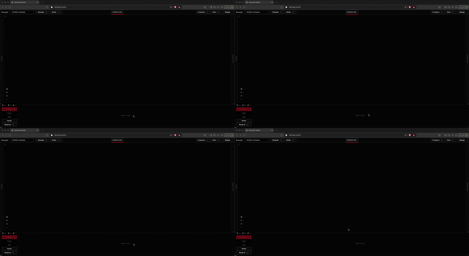

# GroovyUI

<!-- Placeholder — swap for the official ISMIR 2026 / LBD badge when available. -->
[-2026-111111?style=flat-square&labelColor=ff002b&color=111111)](https://ismir2026.ismir.net/)

**Open-source alpha.** Patch-bay for AI audio — wire models in a graph, render sample-accurate offline previews (cached PCM), share workflows as JSON. Not a DAW: no timeline, no live low-latency engine. **Play** auditions the last render from cache; **Render** is explicit.

<p align="center">
  
</p>

<p align="center">
  <a href="https://youtu.be/jwZCArIzonQ"></a>
  &nbsp;
  <a href="https://youtu.be/EkHTXhkB1fE"></a>
</p>

## Status

Experimental. APIs and UI will change. Expect rough edges on clean machines and first model installs.

## Quick start

```bash
# One-time install
uv venv --python 3.11
uv sync --all-packages --group dev
cd apps/studio && npm install && cd ../..

# Every session — API + studio + browser
./scripts/dev.sh
# or: just dev
```

Opens http://127.0.0.1:5173 (API on `:8188`). Ctrl+C stops both.

1. Settings → Inference → **Real** (Stub is for UI/CI only).
2. Pick a featured template (e.g. Hello Groovy or podcast denoise).
3. **Cmd+K** / **Ctrl+K** → install required models if prompted.
4. **Render** → play the cached preview.

First model install can take minutes and gigabytes of disk. Models keep their own licenses (see Compliance).

If `./scripts/dev.sh` says port 8188 is in use, quit the leftover API (`lsof -nP -iTCP:8188 -sTCP:LISTEN`) and retry.

```bash
uv run pytest tests/ -q && cd apps/studio && npm test && uv run groovy-verify
```

Or with [just](https://github.com/casey/just): `just install`, `just test`, `just verify`, `just dev`.

## License

[Apache License 2.0](LICENSE). Third-party models and weights keep their own SPDX licenses — the app license is not a grant to those weights.

Catalog requests from Studio (browser deep link, no GitHub token in the app): Model Browser → **File GitHub request**; Patch Generation → **Blueprint request** / **Node request**. See [CONTRIBUTING.md](CONTRIBUTING.md) and [SECURITY.md](SECURITY.md). Release notes: GitHub Releases.
